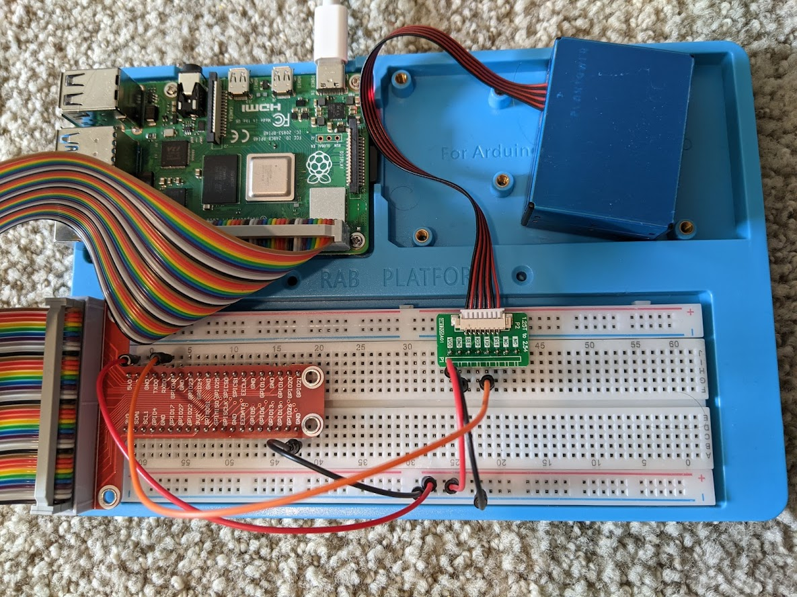
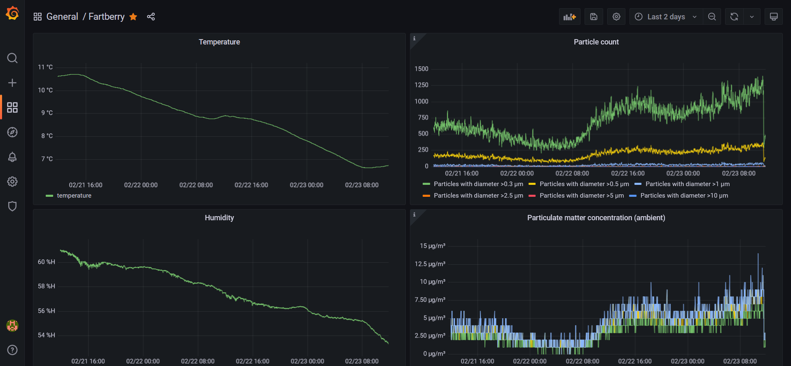
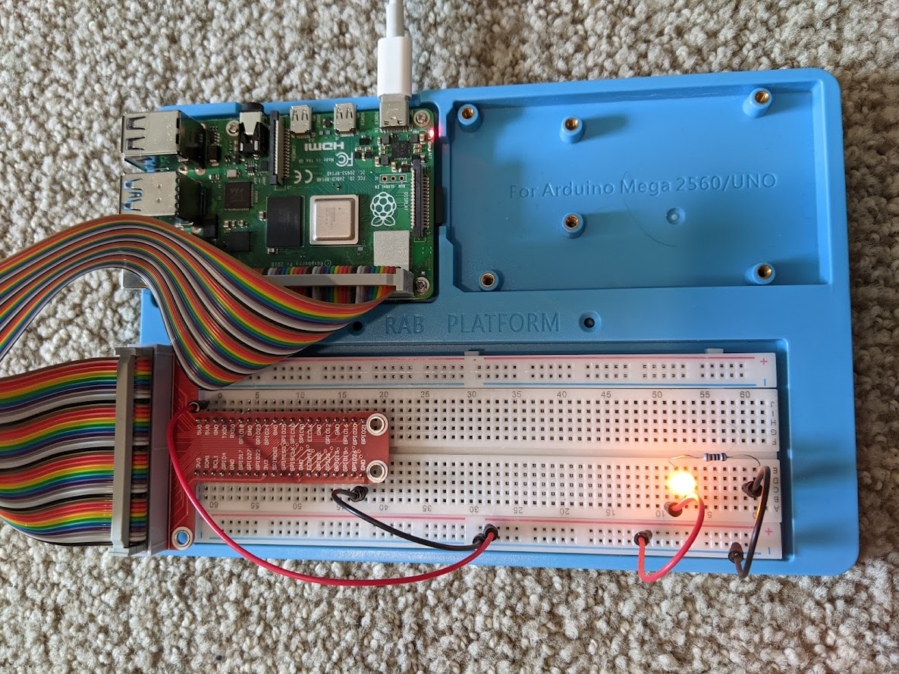
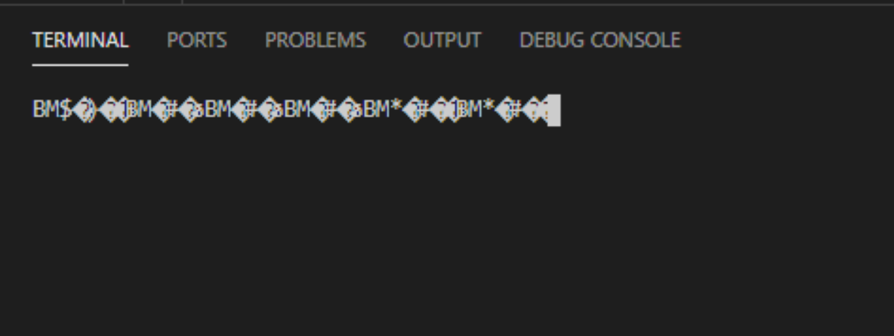

# Fartberry
Fartberry is raspberry pi air quality monitor that measures air temperature, humidity, pressure, and particulate matter in the air. It stores these values in a Postgres SQL database along with geolocation data (optional). It uses the BME 680 sensor for air temperature, humidity and pressure, and the PMS 5003 sensor for particulate matter. Volatile organic compound measure from the BME 680 sensor are not support by this code.



## Run app
1. Install postgres database 11.14+ on the raspberry pi and create a database for this project
2. Edit the `config.json` file with database details and preferences
3. Connect raspberry pi with the BME 680 and PMS 5003 sensor correctly
4. `pipenv run python3 -m fartberry`

## Run app on startup
If you want the fartberry to run whenever you start your raspberry pi, then add this to your crontab
```
@reboot cd /home/pi/development/fartberry && /home/pi/.local/bin/pipenv run python3 -m fartberry
```

## Frontend in Grafana


To display the measurement data I recommend you use Grafana. You can install it to your raspberry pi by downloading [grafana-rpi_8.4.1_armhf.deb](https://grafana.com/grafana/download?pg=get&platform=arm&plcmt=selfmanaged-box1-cta1&edition=oss). Then simply use the web UI to connect Grafana to your database and create a dashboard with panels.

SQL for a temperature panel: 
```
SELECT
  timestamp AS "time",
  temperature
FROM air_quality
WHERE
  $__timeFilter(timestamp)
```

---

# Hardware setup

## Buy equipment
- Raspberry Pi 4 Model B - 2 GB RAM
  - The computer for the project
  - https://www.adafruit.com/product/4292
- PM2.5 Air Quality Sensor and Breadboard Adapter Kit (PMS5003)
  - Particulate matter sensor
  - https://www.adafruit.com/product/3686
- Micro HDMI to HDMI Cable
  - To connect your raspberry pi to a monitor for setup
  - https://www.adafruit.com/product/132
- BME-680 Temperature, Humidity, Pressure and Gas VoC Sensor Breakout Board 
  - Sensor for temperature, humidity, pressure and volatile organic compounds (VOC)
  - https://smile.amazon.com/gp/product/B07CSPJ4KL/
- microSDHC Memory Card
  - Memory card will act as a hard drive for the raspberry pi
  - https://smile.amazon.com/gp/product/B06XYHN68L/
- Raspberry Pi Starter Learning Kit
  - Miscellaneous items for building circuits with the raspberry pi, useful for multiple projects. We mainly need the breadboard , T-cobbler breakout, and jumper wires
- https://smile.amazon.com/gp/product/B07RRWZXDD

## Set up raspberry pi
Set up raspberry pi
Follow the official guide here: https://projects.raspberrypi.org/en/projects/raspberry-pi-setting-up. At the end of this step you should have a raspberry pi running with its operating system, connected to your wifi network and be able to interact with it using a keyboard and mouse

## Set up SSH on your raspberry pi
This will enable you to connect to your raspberry pi remotely from an IDE (eg. VSCode), so you can interact with it from your personal laptop instead of having to connect it to a monitor. This is not necessary as you can do everything from the pi directly, but this is what I prefer. Follow the official guide here: https://www.raspberrypi.org/documentation/remote-access/ssh/

If you are using VSCode, install this extension and use it to connect to your raspberry pi: https://marketplace.visualstudio.com/items?itemName=ms-vscode-remote.remote-ssh

## Set up your first circuit
Wire up an LED light to ensure your breadboard and raspberry pi are working as expected. Explore this website that describes what each GPIO pin is for: https://pinout.xyz/.



## Connect PMS 5003 particulate matter sensor
Wire up the sensor


You should see/feel the fan begin to spin when you connect the power.

## Read data from particulate matter sensor
The PMS5003 communicates over the UART GPIO pins. Learn more about them here: https://pinout.xyz/pinout/uart.

If you have a raspberry pi 4, you need to change the default behaviour of these pins. Follow the "Disable Linux serial console" instruction here: https://www.raspberrypi.org/documentation/configuration/uart.md

Add "dtoverlay=disable-bt" to /boot/config.txt which disables the Bluetooth device and makes the first PL011 (UART0) the primary UART. You must also disable the system service that initializes the modem, so it does not connect to the UART, using "sudo systemctl disable hciuart".

To verify that you can receive data from the sensor, use this command in the terminal "screen /dev/ttyAMA0". You should see garbled characters appear on the screen. This means you are receiving binary data from the sensor. Learn more about the screen command: https://www.cyberciti.biz/faq/unix-linux-apple-osx-bsd-screen-set-baud-rate/



Close the "screen" program by pressing ctrl + a, followed by k.

## Decode data from particulate matter sensor
You can run the python 3 code in my github gist to generate human readable data from the sensor: https://gist.github.com/orelogo/60a9b24ad70240a5b0aa391b5977d841

The gist code is based on Appendix I in the PMS5003 manual: http://www.aqmd.gov/docs/default-source/aq-spec/resources-page/plantower-pms5003-manual_v2-3.pdf (alternative manual link https://cdn-shop.adafruit.com/product-files/3686/plantower-pms5003-manual_v2-3.pdf)

You can convert these concentration values to air quality scores here: https://www.airnow.gov/aqi/aqi-calculator-concentration/

## Connect BME-680 temperature, humidity, pressure, VOC sensor
- Official data sheet: https://www.bosch-sensortec.com/media/boschsensortec/downloads/datasheets/bst-bme680-ds001.pdf
- In raspberry pi's /boot/config.txt, ensure you have the line "dtparam=i2c_arm=on"
https://linux.die.net/man/8/i2cdetect

```
pi@raspberrypi:~/development/fartberry/fartberry $ i2cdetect -y 1
     0  1  2  3  4  5  6  7  8  9  a  b  c  d  e  f
00:          -- -- -- -- -- -- -- -- -- -- -- -- --
10: -- -- -- -- -- -- -- -- -- -- -- -- -- -- -- --
20: -- -- -- -- -- -- -- -- -- -- -- -- -- -- -- --
30: -- -- -- -- -- -- -- -- -- -- -- -- -- -- -- --
40: -- -- -- -- -- -- -- -- -- -- -- -- -- -- -- --
50: -- -- -- -- -- -- -- -- -- -- -- -- -- -- -- --
60: -- -- -- -- -- -- -- -- -- -- -- -- -- -- -- --
70: -- -- -- -- -- -- -- 77 
```

- BME 680 soldering guide: https://learn.adafruit.com/adafruit-bme680-humidity-temperature-barometic-pressure-voc-gas/assembly
- Sample code instructions http://wiki.hivetool.org/Sensors:_BME680
- Primori python code: https://github.com/pimoroni/bme680-python/blob/master/examples/read-all.py
- Primori doc: https://learn.pimoroni.com/tutorial/sandyj/getting-started-with-bme680-breakout

## Other resources

- Similar project https://www.markhansen.co.nz/raspberry-pi-air-quality-sensor/
- PMDS5003 code https://github.com/pimoroni/pms5003-python
- Code for getting data from PMS5003 https://www.raspberrypi.org/forums/viewtopic.php?t=250558
- Interpreting sensor values: https://publiclab.org/questions/samr/04-07-2019/how-to-interpret-pms5003-sensor-values
- BME 680 official website: https://www.bosch-sensortec.com/products/environmental-sensors/gas-sensors/bme680/
- BME 680 technical doc: https://www.bosch-sensortec.com/media/boschsensortec/downloads/datasheets/bst-bme680-ds001.pdf
- BME 680 video: https://www.youtube.com/watch?v=DwIrGtn9Eog
- BME 680 tutorial: https://randomnerdtutorials.com/bme680-sensor-arduino-gas-temperature-humidity-pressure/